<p align="center">
  <h1 align="center">🏠 KasKos</h1>
  <p align="center">
    <b>Sistem Informasi Manajemen Kos Berbasis Web Sebagai Media Transparansi Keuangan Patungan dan Pemetaan Denah Kamar Digital</b>
  </p>
</p>

---

# 📖 Tentang KasKos

**KasKos** merupakan aplikasi berbasis web yang dirancang untuk membantu pengelolaan kos secara efisien, rapi, dan transparan.

Sistem ini memisahkan hak akses antara **Admin (Pengelola Kos)** dan **Tenant (Penghuni Kos)** sehingga proses pengelolaan kos menjadi lebih terstruktur, mulai dari:

- 🏠 Manajemen data kamar
- 💰 Pembayaran sewa kamar
- 🤝 Tagihan patungan penghuni
- 🗺️ Denah kamar digital interaktif
- 📜 Riwayat perpindahan penghuni
- 📊 Dashboard statistik

---

# 🛠 Tech Stack

| Teknologi | Keterangan |
|-----------|------------|
| Backend | Laravel 13 |
| Bahasa | PHP 8.x |
| Database | MySQL (`kaskos_db`) |
| Frontend | Blade, Tailwind CSS, Alpine.js |
| Authentication | Laravel Breeze |
| Authorization | Spatie Laravel Permission |
| API | Laravel Eloquent API Resource |

---


# 🌿 Git Workflow

## Format Branch

```text
fitur/nama-fitur-namaanggota
```

Contoh

```text
fitur/kamar-ahnaf
fitur/rooms-history-daffa
fitur/tagihan-fauzi
fitur/personal-payment-melani
fitur/dashboard-tia
```

---

## Alur Git

```text
Branch Fitur
      │
      ▼
 Commit
      │
      ▼
 Push GitHub
      │
      ▼
 Pull Request
      │
      ▼
 Code Review
      │
      ▼
 Merge ke Main
```

> **Catatan:** Dilarang melakukan commit langsung ke branch **main**.

---

# 🌐 REST API

## 1. API Kamar

| Method | Endpoint | Deskripsi |
|---------|----------|-----------|
| GET | `/api/room` | Semua kamar |
| POST | `/api/room` | Tambah kamar |
| GET | `/api/room/{id}` | Detail kamar |
| PUT | `/api/room/{id}` | Update kamar |
| DELETE | `/api/room/{id}` | Hapus kamar |
| GET | `/api/room/{id}/history` | Riwayat kamar |

### Contoh Request

```json
{
    "room_number": "A-102",
    "floor": 1,
    "rental_price": 1500000,
    "status": "vacant",
    "description": "Kamar AC lantai 1"
}
```

---

## Update Kamar

```json
{
    "room_number": "B-03",
    "floor": 2,
    "rental_price": 1500000,
    "status": "occupied",
    "tenant_id": 2,
    "description": "Kamar lantai 2 non AC"
}
```

---

## 2. API Kategori Tagihan

| Method | Endpoint |
|---------|----------|
| GET | `/api/kategori-tagihan` |
| POST | `/api/kategori-tagihan` |
| GET | `/api/kategori-tagihan/{id}` |
| PUT | `/api/kategori-tagihan/{id}` |
| DELETE | `/api/kategori-tagihan/{id}` |

### Contoh Request

```json
{
    "nama_kategori": "WiFi",
    "nominal_default": 50000
}
```

---

### Update

```json
{
    "nominal_default": 60000
}
```

---

# 🔑 Akun Default

## Admin

```
Username : admin
Password : password
```

## Tenant

```
Username : budi_tenant
Password : password
```

---

# 📦 Instalasi Project

## 1. Clone Repository

```bash
git clone https://github.com/ahnaf2410/KasKos.git
cd KasKos
```

---

## 2. Install Dependency

```bash
composer install
npm install
```

---

## 3. Konfigurasi Environment

```bash
cp .env.example .env

php artisan key:generate
```

---

## 4. Database

```env
DB_CONNECTION=mysql
DB_HOST=127.0.0.1
DB_PORT=3306
DB_DATABASE=kaskos_db
DB_USERNAME=root
DB_PASSWORD=
```

---

## 5. Migration

```bash
php artisan migrate:fresh --seed
```

---

## 6. Jalankan Project

Frontend

```bash
npm run dev
```

Backend

```bash
php artisan serve
```

Buka browser

```
http://127.0.0.1:8000
```

---

# ✅ Checklist Demo

- [x] Relasi User ↔ Kamar
- [x] Rooms History
- [x] Denah Kamar
- [x] Klaim Kamar
- [x] CRUD Tagihan
- [x] Auto Split Tagihan
- [x] Upload Bukti Pembayaran
- [x] Approval Pembayaran
- [x] Payment Pribadi
- [x] Dashboard Admin
- [x] Dashboard Tenant
- [x] REST API
- [x] Pull Request telah di-merge

---

# 📷 Screenshot Aplikasi

Berikut merupakan tampilan antarmuka aplikasi **KasKos**.

## 🌸 Splash Screen

<p align="center">
  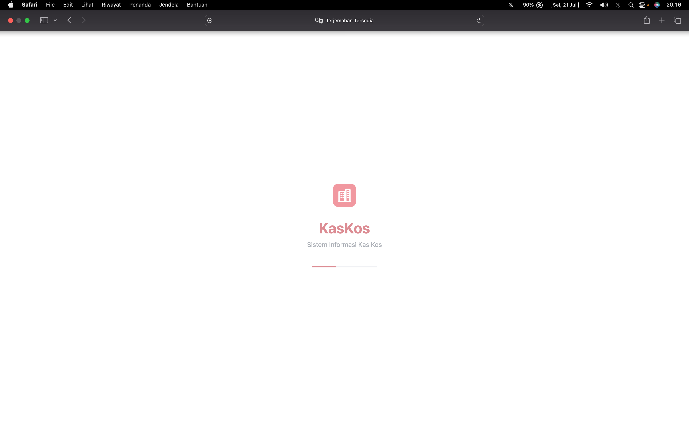
</p>

## 🌸 Login

<p align="center">
  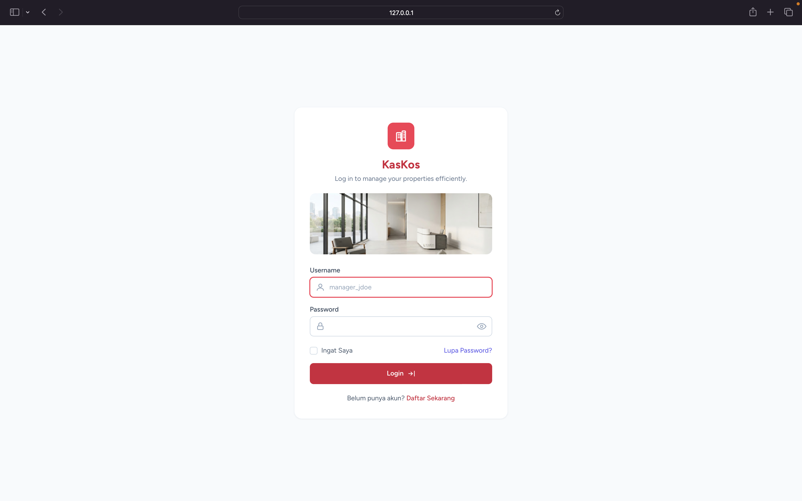
</p>

---

# 👨‍💼 Admin

## 📊 Dashboard Admin

<p align="center">
  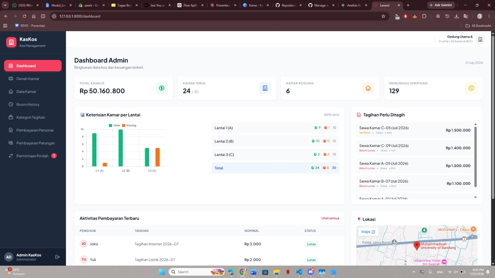
</p>

## 🏠 Denah Kamar

<p align="center">
  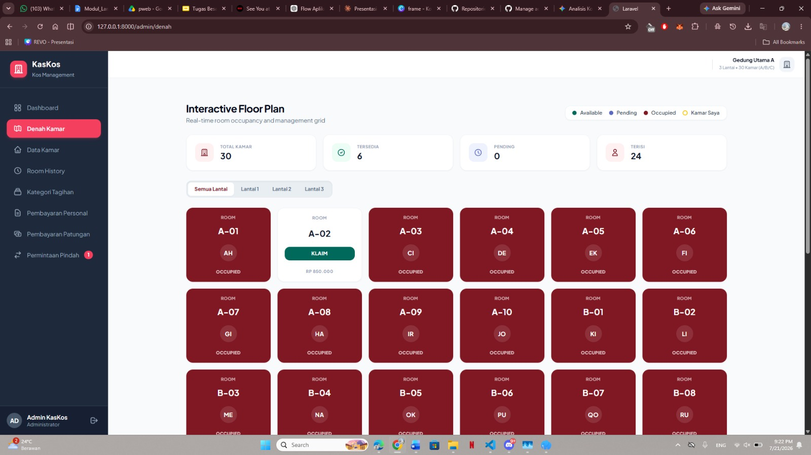
</p>

## 🚪 Data Kamar

<p align="center">
  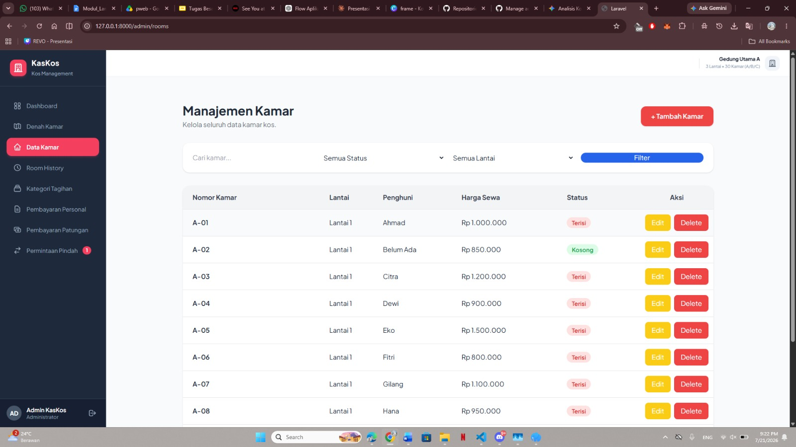
</p>

## 📜 Rooms History

<p align="center">
  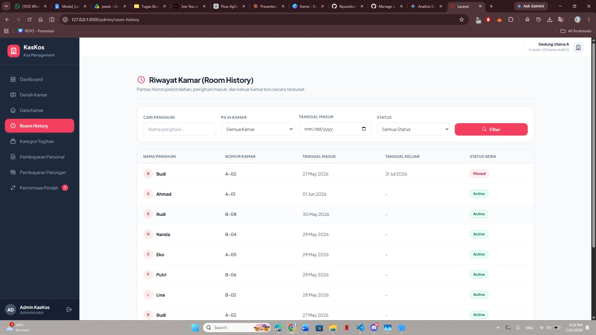
</p>

## 💡 Kategori Tagihan

<p align="center">
  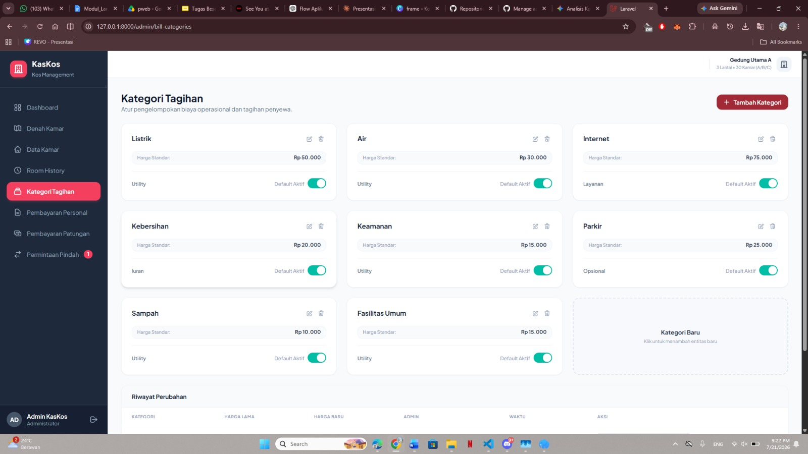
</p>

## 💳 Pembayaran Personal

<p align="center">
  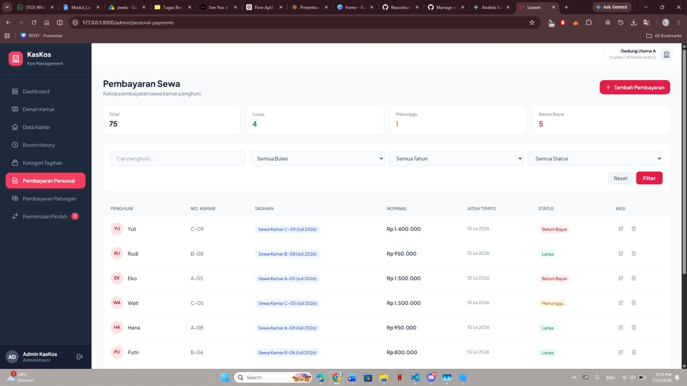
</p>

## 🤝 Pembayaran Patungan

<p align="center">
  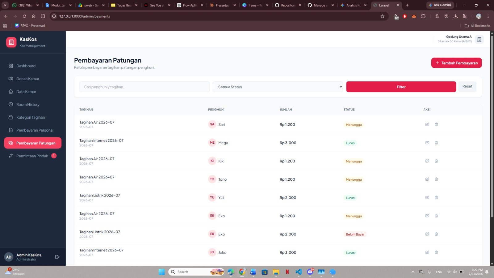
</p>

## 🤝 Permintaan Pindah

<p align="center">
  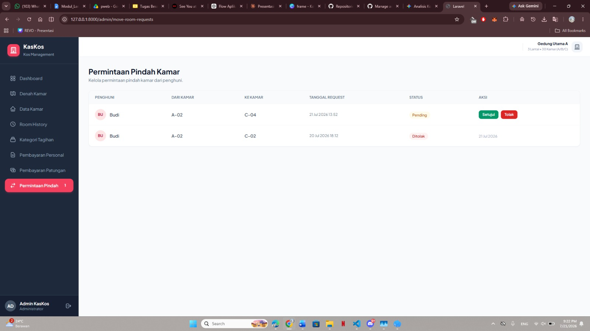
</p>

---

# 👤 Tenant

## 📊 Dashboard Tenant

<p align="center">
  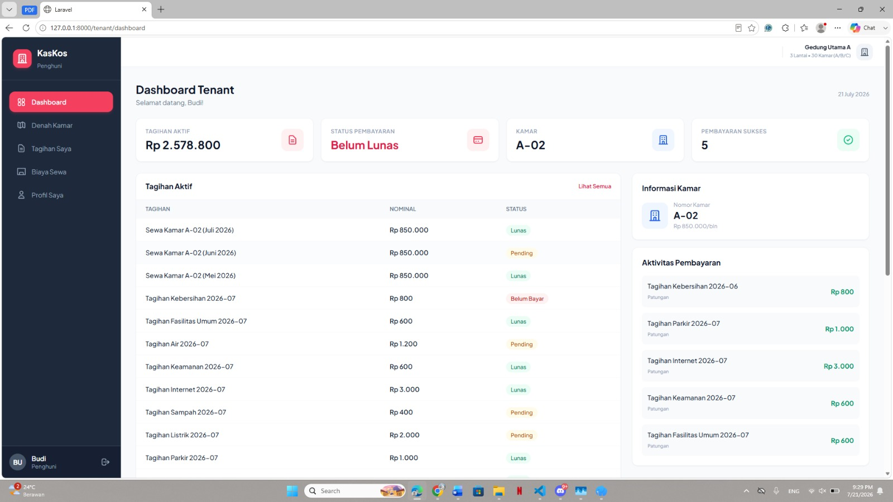
</p>

## 🏠 Denah Kamar

<p align="center">
  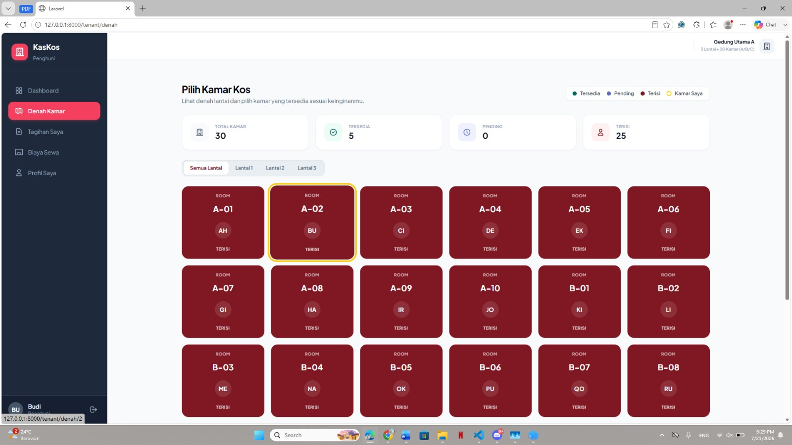
</p>

## 💰 Tagihan Saya

<p align="center">
  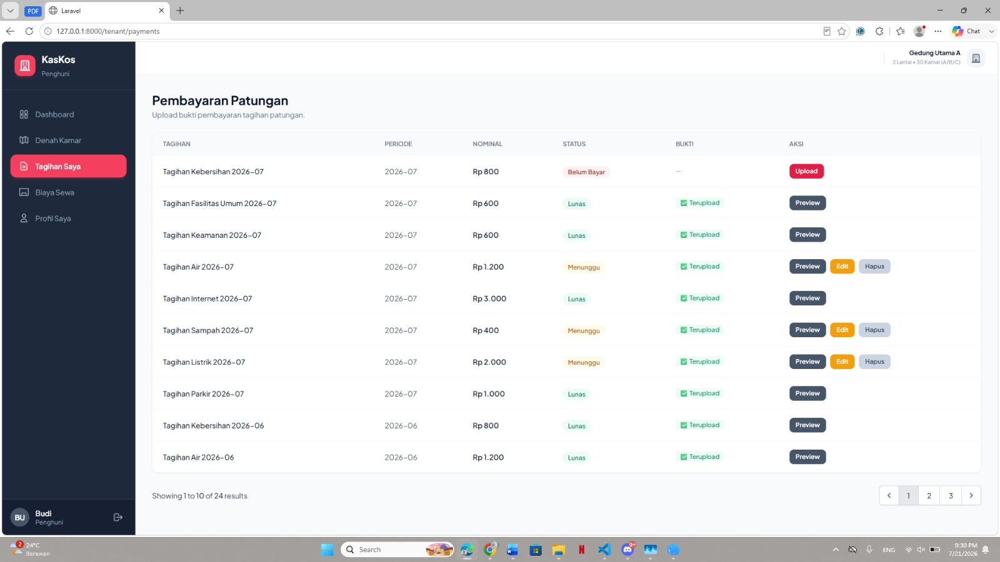
</p>

## 🤝 Biaya sewa

<p align="center">
  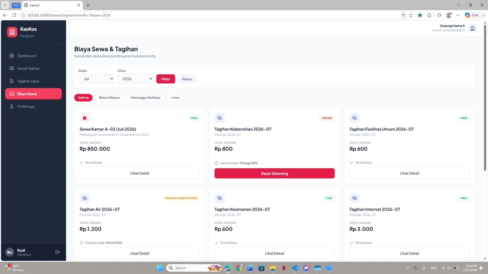
</p>

## 👤 Profil Saya

<p align="center">
  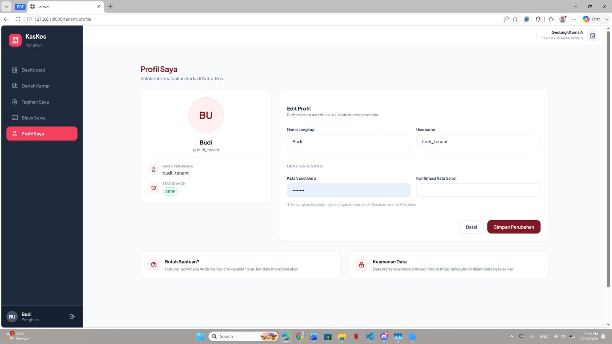
</p>
---

# 📌 Progress Tim

## ✅ Checkpoint 1

Pondasi proyek dikerjakan bersama oleh seluruh anggota.

- Setup Laravel 13
- Laravel Breeze Authentication
- Setup Role & Permission (Spatie)
- Perancangan ERD
- Pembuatan Database
- Setup Git Repository
- Konfigurasi Environment

---

## ✅ Checkpoint 2

Setiap anggota menyelesaikan pondasi modul masing-masing.

- Database Migration
- Model & Relasi
- CRUD Dasar
- Routing
- Blade View
- Search
- Pagination (10 data)

---

# 👨‍💻 Pembagian Tugas

---

## 👤 Ahnaf Musyaffa (230102012)

**Branch**

```
fitur/kamar-ahnaf
fitur/kamar-user-ahnaf
```

### Modul

- CRUD Data Kamar
- Relasi User ↔ Kamar
- Assign Penghuni
- Pindah Penghuni
- Kosongkan Kamar
- Update Status Kamar Otomatis
- Integrasi Rooms History

---

## 👤 Daffa Aqila Riyadi (230102031)

**Branch**

```
fitur/rooms-history-daffa
fitur/denah-daffa
fitur/api-kamar-daffa
```

### Modul

- Observer Rooms History
- Halaman Rooms History
- Denah Kamar Interaktif
- Klaim Kamar
- REST API Kamar
- REST API Rooms History

---

## 👤 Fauzi Maulana Akbar (230102049)

**Branch**

```
fitur/tagihan-fauzi
fitur/api-tagihan-fauzi
```

### Modul

- CRUD Kategori Tagihan
- CRUD Tagihan Patungan
- Auto Split Tagihan
- Relasi Tagihan
- REST API Kategori Tagihan

---

## 👤 Melani Anggraena (230102073)

**Branch**

```
fitur/pembayaran-patungan-melani
fitur/payment-pribadi-melani
```

### Modul

- Splash Screen
- Welcome Page
- CRUD Pembayaran Personal (Admin)
- CRUD Pembayaran Patungan (Admin)
- CRUD Pembayaran Tenant
- Upload Bukti Transfer
- Approval / Rejection Pembayaran
- Dokumentasi README

---

## 👤 Tia Pebriyanti (230102125)

**Branch**

```
fitur/dashboard-tia
fitur/testing-tia
fitur/readme-tia
```

### Modul

- Database Architect
- Seeder
- Dashboard Admin
- Dashboard Tenant
- Statistik
- Permintaan Pindah
- Quality Assurance
- Feature Testing
- API Testing
- Dokumentasi

---

# 📄 Informasi Akademis

Project ini disusun sebagai **Tugas Besar Mata Kuliah Pemrograman Web Berbasis Framework** Program Studi **Teknik Informatika** Universitas Muhammadiyah Bandung.

---

<p align="center">
<b>🏠 KasKos © 2026</b><br>
Made with ❤️ by Tim KasKos
</p>
